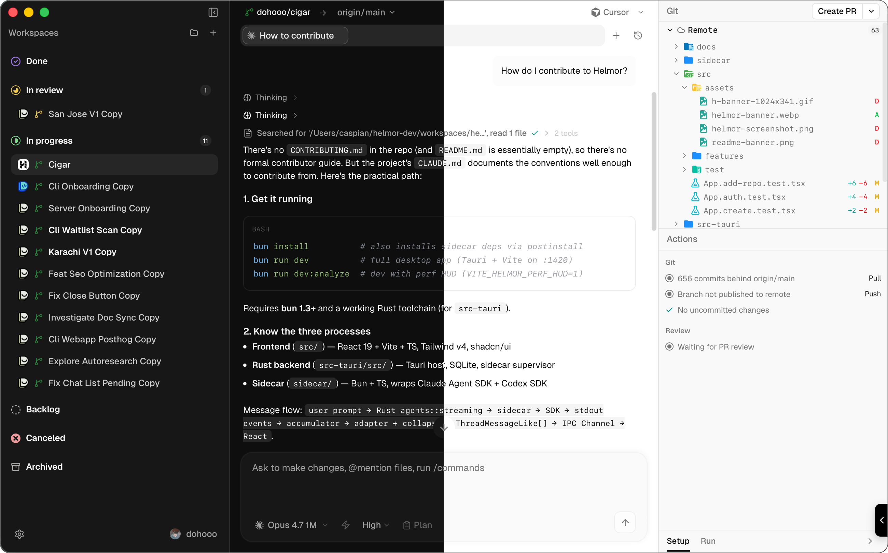

  

<h1 align="center">Winthorpe</h1>

  Winthorpe is a local-first Windows workbench for multi-agent software development.

> AI made coding faster.
>
> Winthorpe is about finishing the rest of the loop.
>
> Not just generating more code.
>
> Reviewing, testing, merging, and actually shipping software — across multiple parallel sessions, in one window, on Windows.

## Install

  

[**Download for Windows** →](https://github.com/plsft/winthorpe/releases)

## Contributing

Open Winthorpe, Import Winthorpe, Ask Winthorpe:

> _"How do I contribute to Winthorpe?"_

That's the guide.

## License

[Apache 2.0](./LICENSE)
